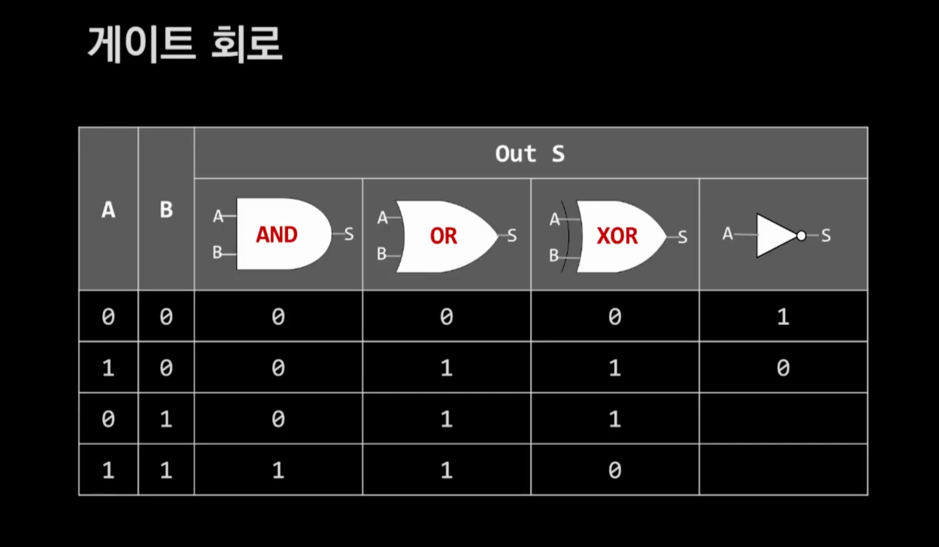
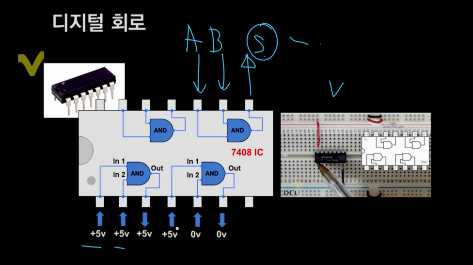

# Part1

## 컴퓨터와 2진법

- 컴퓨터는 전류의 켜짐/꺼짐 상태를 0과 1로 표현하는 디지털 방식으로 작동하며, 모든 정보 처리가 이 방식으로 이루어짐
- 1bit는 전기 스위치 1개를 의미
- 스위치가 On 상태는 1, 흐르지 않는 Off (2가지)
- 여러 스위치(혹은 전선)를 4개씩 묶어주면 4bit
- n개의 비트로는 2의 n제곱 개의 상태를 표현할 수 있다. 4bit는 2의4승 으로 계산되어 16가지의 다른 조합이 가능

# 게이트회로

# 컴퓨터가 덧셈을 어떻게 할까 그래서..

- 2진수 1+1 은 2진수 10(2) 이다
- A가 1, B가 1이면 XOR 연산결과 S는 0이다
- 동시에 A가 1, B가 1이면 AND 연산결과 C는 1이다. 이 1은 자리 올림(Carry)이다.

- 