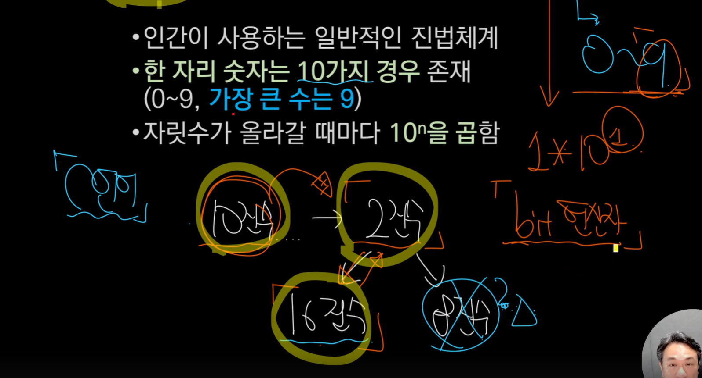

# 💻 C언어와 진법 변환 핵심 정리

> **진법 변환**은 C언어뿐만 아니라 컴퓨터 전반에서 매우 중요한 기본기입니다.

---

## 🔢 10진수 ↔ 2진수 ↔ 16진수 변환표

| 10진수 | 2진수  | 16진수 |
| :----: | :----: | :----: |
|   0    | 0000   |   0    |
|   1    | 0001   |   1    |
|   2    | 0010   |   2    |
|   3    | 0011   |   3    |
|   4    | 0100   |   4    |
|   5    | 0101   |   5    |
|   6    | 0110   |   6    |
|   7    | 0111   |   7    |
|   8    | 1000   |   8    |
|   9    | 1001   |   9    |
|  10    | 1010   |   A    |
|  11    | 1011   |   B    |
|  12    | 1100   |   C    |
|  13    | 1101   |   D    |
|  14    | 1110   |   E    |
|  15    | 1111   |   F    |

---

## 🟪 16진수(Hex) 표기가 사용되는 예시

- 🎨 **색상 표현 (RGB)**
- 🏷️ **컴퓨터 하드웨어 주소**
- 💾 **메모리 값 표현**

---

## ❓ 진법 관련 자주 묻는 질문

### 1. 컴퓨터가 2진법(바이너리)을 주로 사용하는 가장 근본적인 이유는?

- **A:** 컴퓨터의 내부 상태가 ON/OFF 두 가지로 표현되기 때문입니다.
- **해설:** 컴퓨터는 전기 신호의 ON/OFF 상태로 데이터를 처리합니다. 이 두 가지 상태를 가장 효율적으로 표현할 수 있는 수 체계가 2진법(0과 1)이기 때문에, 컴퓨터는 2진법을 사용합니다.

---

### 2. 프로그래밍에서 16진법(Hexadecimal)이 자주 사용되는 중요한 이유는?

- **A:** 2진수를 더 간결하고 효율적으로 표현할 수 있기 때문입니다.
- **해설:** 16진수는 4개의 2진수 비트(bit)를 하나의 숫자로 표현합니다. 긴 2진수를 짧고 읽기 쉬운 형태로 바꿀 수 있어서, 컴퓨터 내부 상태나 메모리 주소를 다룰 때 매우 유용합니다.

---

### 3. 16진수에서 숫자 9 다음으로 오는 'A'는 10진수로 어떤 값을 나타낼까?

- **A:** 10
- **해설:** 16진수는 0~9, A~F(A=10, B=11, ..., F=15)까지 총 16개의 기호를 사용합니다.

---

### 4. 컴퓨터 메모리 관점에서 1바이트(Byte)는 몇 비트(Bit)로 구성될까요?

- **A:** 8비트
- **해설:** 컴퓨터에서 데이터를 다루는 기본 단위 중 하나가 바이트입니다. 1바이트는 8개의 비트로 이루어져 있으며, 이는 16진수 2자리로 표현됩니다.

---

### 5. RGB 컬러 시스템에서 색상을 표현할 때 16진수가 자주 사용되는 이유는 무엇일까요?

- **A:** RGB 각 색상 성분(Red, Green, Blue)의 값을 8비트(2자리 16진수)로 간결하게 표현할 수 있기 때문입니다.
- **해설:** RGB 색상은 빨강, 초록, 파랑 세 가지 성분의 조합으로 만듭니다. 각 성분의 강도를 0부터 255까지(8비트)로 나타내는데, 2자리의 16진수로 표현하면 간결하고 읽기 편해서 웹 등에서 널리 쓰입니다.

---

## 📝 참고

진법 변환은 임베디드, 시스템 프로그래밍, 네트워크 등 다양한 분야에서 반복적으로 사용됩니다.  
반드시 숙지해두면 실무에서 큰 도움이 됩니다
